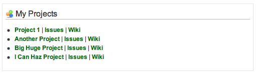

Redmine plugin: My Projects
=============================

My Projects is a simple plugin that displays your assigned projects on your home screen.

Installation
============
1. Clone latest version of plugin from git, install it to plugins. 
	* `git clone https://github.com/peelman/my_projects.git`

2. Make sure your plugin folder name is *my_projects*

3. Restart your Redmine web servers
	* `touch /path/to/redmine/tmp/restart.txt`

Plugin should work now.

Contact
=======

You can log bugs and feature requests for this plugin here:
http://github.com/peelman/my_projects/issues
